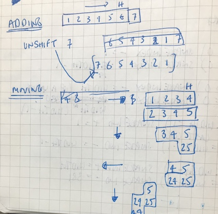

##  Software Engineering Immersive Course

# Project 01 - GAME - The Very Hungry Caterpillar


 

## Brief
Design a grid-based game using HTML, CSS, and JavaScript technologies learnt in the first three weeks of the course. Players must be able to win and lose.

Timeframe: 1 week, independent coding


## Summary
My first coding project was built with vanilla JavaScript using Flexbox and CSS3 to apply styling. Although the game is based on the classic Nokia 3210 game 'Snake', I eventually substituted the snake for a caterpillar using Eric Care's 'The Very Hungry Caterpillar' as my inspiration. The Caterpillar must eat the foods shown on the right of the screen in order to win and transform into a butterfly.

I used DOM manipulation to enable the player to guide the caterpillar to eat the array of foods as they appear on the game grid at random. Each bite increases the player's score, and the length and speed of the caterpillar. The game is over if the caterpillar collides with the edge of the board.


## Deployment
View code on GitHub here: github.com/sophieturnell/project-01.  
Use the "clone or download" button and open the index.html file in your browser.  


## Technologies & Methodologies Used
- HTML5
- CSS3
- Vanilla JavaScript (ES6)
- Google Fonts
- Flexbox Layout Module
- GitHub
- Git
- Adobe Photoshop
- Adobe Illustrator


## Features
- When the player presses play the timer starts and the caterpillar begins to move
- The player can change the direction of the caterpillar using the up, down, left and right keys
- The caterpillar eats the foods, which appear as in the book below:


- When the caterpillar eats the food:
  - the food item is removed and the next food item is generated in a random cell;
  - the caterpillar grows in length;
  - the caterpillar moves faster;
  - the score board records the number of foods eaten;

- Win condition: the caterpillar eats all of the foods on the list on the right (if I had had more time the caterpillar would turn into a butterfly).

- Lose condition: the caterpillar collides with a wall

- A reset button:
  - removes the dead caterpillar;
  - removes the score;
  - resets the speed of the caterpillar;
  - restarts the countdown timer and resets the food to start from the beginning of the list.

- A start button adds new food and a new moving caterpillar


## Website Architecture


## Approach

### Day 1 & 2
When we were offered a choice of 10 grid-based games to build I can remember feeling daunted by the prospect. I spent the first two days working out which game I wanted to build and how it would work. Although this was not the most effective use of my time for getting the project finished, it consolidated my understanding of our first three weeks of lessons.

I decided to choose Snake as I had a clear idea of how the logic might work and ideas on how to style the game uniquely.

*Brainstorming*  


### Day 3
I realised that reaching my MVP of having a working game logic with a win and lose condition would take me most of the week.

I broke down the game into the following elements:
- Building a grid;
- Adding food items at random;
- Creating a snake;
- Moving the snake; and
- Killing the snake when it collides with a wall.

I drafted the logic for these elements as a reference on paper then used pseudocode to build the first digital draft in VS Code. I knew I wanted to add a score bar and timer so I factored in space for these in my wireframes and started to build the structure in HTML5, formatting it with the Flexbox Layout Module in CSS3. 

### Day 4
I started to add the logic for the elements outlined above which relied heavily on trial and error. A combination of lists and adding tasks to a calendar enabled me to effectively manage my time throughout the project. My notebook is now full of amended lists as different items took priority. 

*First big success: moving the snake*  


```JavaScript
  // CHANGE DIRECTION OF SNAKE ARRAY
  function moveSnakeDown() {
    eraseSnake()
    snakeArray.pop()    // deletes last cell in snakeArray
    snakeArray.unshift(snakeArray[0] + width)   // adds width of grid to the head of snakeArray cell (one row down)
    drawSnake()
  }

  function moveSnakeUp() {
    eraseSnake()
    snakeArray.pop()
    snakeArray.unshift(snakeArray[0] - width)   // subtracts width of grid to head cell (one row up)
    drawSnake()
  }

  function moveSnakeLeft() {
    eraseSnake()
    snakeArray.pop()
    snakeArray.unshift(snakeArray[0] - 1)    // subtracts one cell from head of snakeArray
    drawSnake()
  }

  function moveSnakeRight() {
    eraseSnake()
    snakeArray.pop()
    snakeArray.unshift(snakeArray[0] + 1)    // adds one cell to head of snake array
    drawSnake()
  }
```

### Day 5
I worked on the directions keys for the snake and removed the food when the cells matched. This took all day and frustratingly only some of the food was disappearing when it should. 

### Day 6
As there were only two days remaining I decided to work on the CSS and transformed the snake into a caterpillar. I added a progress bar to show the score; a countdown timer; and start/reset buttons. I was up very late trying to get these all to work so in future I will try not to make these sorts of additions at the last minute. 

### Day 7
I underestimated the time required to add CSS. At this point there were several improvements to functionality and styling that I wanted to make and in hindsight I should have focused on the functionality. 

*New Layout idea*  
 

Although the presentation went well, the screen scrolled slightly when using the direction keys and the start and reset buttons weren't working fully so the user had to refresh the page when they had scrolled to the game screen. I have since fixed this, although there are still some problems I'd like to solve with more time.


## Challenges Still To Overcome
- Removing the food after the reset button has been pressed
- Making the timer stop play when the time has run out
- Killing the caterpillar when it collides with itself

*Collision code attempt*  


```JavaScript
 // SNAKE COLLIDES WITH ITSELF GAME OVER
  function killSnake() {
    if (snakeArray.slice(1).includes(snakeArray[0])) { // if snake body includes snake head game over
      console.log('snake bites itself')
      // return gameOver()
    }
  }
```


## Future Improvements

**Minor improvements:**

- Animate the list of foods on the right of the screen
- Add win screen with a butterfly
- Add styling to the head of the caterpillar

**Larger improvements:**

- Make the game responsive
- Add a multi-player mode
- Add a high score table


## Successes
- Establishing the correct order of the various functions
- Adding functionality to the buttons

```JavaScript
 // RESET BUTTON
  resetButton.addEventListener('click', () => {
    console.log('reset button clicked')
    gameOver()
    eraseSnake()
    timerNumber = 50
    timerId = 0
    currentCountdown.innerHTML = timerNumber
    timeRemaining.style.width = 100 + '%'
    score = 0
    scoreDisplay.innerHTML = score
    userScore.style.width = (score * 5) + '%'
    grid.classList.remove('food')
  })
```  

- Stopping the screen from scrolling when using the keys to direct the caterpillar

```JavaScript
  // STOP DEFAULT SCROLLING
  window.addEventListener('keydown', function (e) {
    if ([37, 38, 39, 40].indexOf(e.keyCode) > -1) {
      e.preventDefault()
    }
  }, false)
```

- Using the score as the index to determine which food item should be displayed next

``` JavaScript
// CHANGE FOOD ITEM
  function changeFoodItem() {
    const foodArrayURL = [
      './assets/apple.png',
      './assets/pear.png',
      './assets/pear.png',
      './assets/plum.png',
      './assets/plum.png',
      './assets/plum.png',
      './assets/strawberry.png',
      './assets/strawberry.png',
      './assets/strawberry.png',
      './assets/strawberry.png',
      './assets/orange.png',
      './assets/orange.png',
      './assets/orange.png',
      './assets/orange.png',
      './assets/orange.png',
      './assets/chocolateCake.png',
      './assets/iceCreamCone.png',
      './assets/pickle.png',
      './assets/swissCheese.png',
      './assets/sliceOfSalami.png',
      './assets/lolly.png',
      './assets/cherryPie.png',
      './assets/sausage.png',
      './assets/cupcake.png',
      './assets/watermelon.png'
    ]
    foodArrayURL.forEach(element => element)
    document.querySelector('.food').style.backgroundImage = `url('${foodArrayURL[score]}')`
  }
```
- Removing rogue strawberries that remained after they had been eaten


## Takeaways
In future I need to be careful not to get overexcited by the planning stage and to focus on hitting the MVP early. Allocating time to styling and experimenting with individual lines of code helped my understanding throughout. It allowed me to visualise the project more clearly and develop ideas on how to solve problems. I found console logging particularly useful for displaying what was running.


___


linkedin.com/in/sophieturnell/

___
 